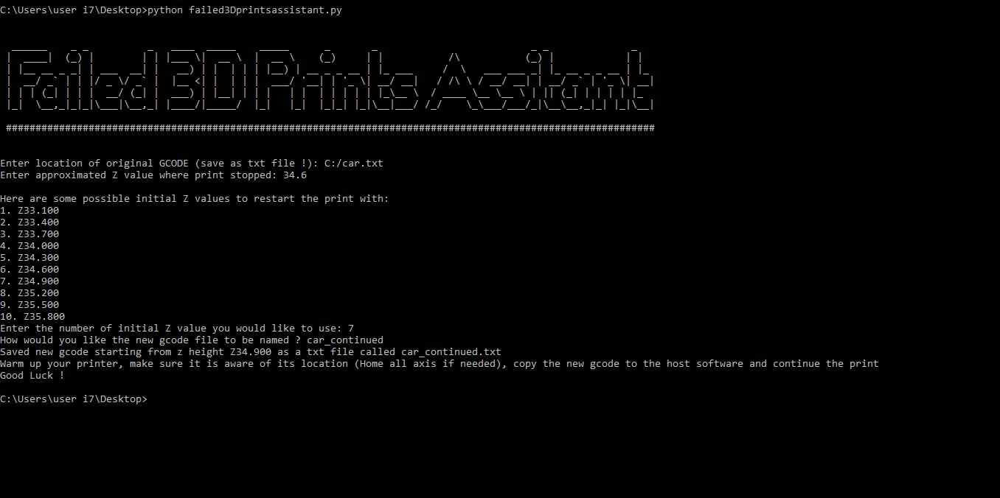
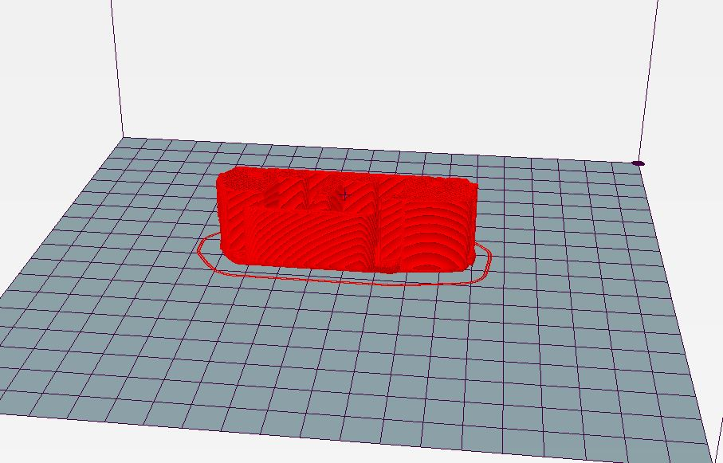
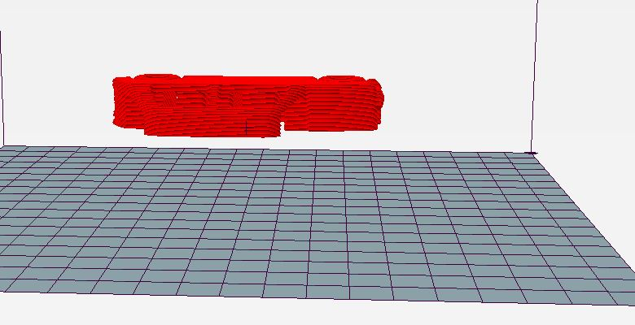

# Failed_3DPrints_Assistant
A python script that helps easily continue 3D prints that stopped mid-way.

Instructions:
The script will run you through everything you need. Move your extruder near the print and use a piece of paper to find the right proximity. Use the M114 command to find the correct Z height (The script will suggest some for you based on what you measured, so the measurement doesn't have to be extremely precise).  Make sure you don't move the print before you begin the process.

Example:

print stopped at: 

script generated: 

final result:

